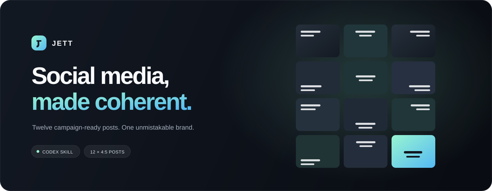

<p align="center">
  
</p>

<p align="center">
  <a href="https://github.com/omerucan0/jett-social-media/actions/workflows/ci.yml"></a>
  
  
</p>

# Jett Social Media

**A production-minded Codex skill for creating complete, brand-specific Instagram campaigns.**

Jett turns a real brand brief into twelve coordinated 4:5 posts: original background imagery, exact typography, a deliberate feed rhythm, a 3×4 review sheet, and upload-ready files. Image generation handles the scenes. A deterministic HTML renderer handles the words. Nothing guesses your logo, invents testimonials, or claims a campaign was published when it was not.

## What ships

| Output | Details |
| --- | --- |
| 12 finished posts | Individual PNG files, each **1080 × 1350** |
| One coherent feed | A fixed 3×4 composition with balanced text placement |
| Brand-specific art direction | Brand colors, type, offer, audience, language, and optional logo |
| Review evidence | Contact sheet, technical QA report, and recorded visual-review status |
| Clean handoff | Ready-to-upload assets plus a packaged ZIP |

## Install

Clone the repository into your Codex skills directory:

```bash
git clone https://github.com/omerucan0/jett-social-media.git ~/.codex/skills/jett-social-media
```

On Windows with PowerShell:

```powershell
git clone https://github.com/omerucan0/jett-social-media.git "$HOME\.codex\skills\jett-social-media"
```

Open a new Codex task, then ask for the skill by name:

```text
Use $jett-social-media to create a 12-post Instagram launch campaign
for my brand using the attached logo, brand guidelines, and reference images.
```

### What to provide

Share the brand name, sector, offer, audience, campaign goal, language, colors, and preferred typography. Logo files, approved evidence, reference images, brand voice, and a call to action are helpful when available.

Missing colors or type can be proposed, but they remain explicitly marked as proposals until approved. Unsupported claims, fabricated metrics, and invented testimonials are never substituted for real evidence.

## How it works

1. **Understand the brief.** Separate brand references, visual inspiration, logo assets, and proof.
2. **Plan twelve posts.** Build a connected narrative from the opening problem to the final call to action.
3. **Generate clean scenes.** Create one text-free 4:5 background per post, with space reserved for its typography.
4. **Render the exact copy.** Use HTML, Playwright, and Sharp to produce deterministic final artwork.
5. **Verify the campaign.** Check dimensions, filenames, unique image content, layout rules, and supported claims.
6. **Review and deliver.** Inspect the feed, record the visual-review result, and package the final files.

The visual-review status stays `UNVERIFIED` until a person or vision-capable agent actually checks the artwork.

## Manual workflow

**Requirements:** Python 3.10+, Node.js 20+, and a Codex environment with image-generation access.

Create a campaign from the bundled template:

```bash
python scripts/init_campaign.py \
  --dest /absolute/path/to/campaign \
  --brand-name "Your Brand" \
  --campaign-slug your-brand-launch \
  --language en
```

Complete `brand/brand.json` and `content/posts.json`, then add the twelve generated background files to `assets/backgrounds/`.

From the campaign directory:

```bash
npm install
npx playwright install chromium
npm run build
```

Inspect the generated contact sheet and representative full-size posts. Record the review before producing the final QA report:

```bash
node scripts/record-visual-review.mjs \
  --status pass \
  --notes "Reviewed the contact sheet and posts 01, 04, 08, and 12."

npm run verify
```

Package the deliverables:

```bash
python /absolute/path/to/jett-social-media/scripts/package_delivery.py \
  --campaign /absolute/path/to/campaign \
  --desktop-dir /absolute/path/to/delivery
```

```text
Your Brand - 12 Post Final/
├── 01-opening-hook.png
├── …
├── 12-final-cta.png
└── preview/
    ├── contact-sheet.png
    ├── qa-report.json
    └── your-brand-launch.zip
```

## Repository layout

```text
jett-social-media/
├── SKILL.md                         Skill entrypoint and operating rules
├── agents/openai.yaml              Codex display name and invocation metadata
├── assets/campaign-template/       Reusable HTML, Node.js, and rendering assets
├── references/                     Intake, content, image, and QA guidance
└── scripts/                        Campaign scaffolding, validation, and delivery
```

The `agents/` directory contains standard Codex skill metadata. It does not run an autonomous agent or connect to an external service.

## Development

Run the regression suite from the repository root:

```bash
python scripts/test_skill.py
```

GitHub Actions checks the Python workflow and JavaScript syntax on both Linux and Windows.

---

<p align="center"><strong>Twelve posts. One clear identity.</strong></p>
